# Active Directory Home Lab

I built this lab to practice the kinds of tasks I'd actually be doing on a helpdesk: managing user accounts, troubleshooting login issues, dealing with mapped drives, fixing permissions problems on shared folders, and using the basic tools (ADUC, Group Policy, Command Prompt) that show up in most Windows IT environments. It's a Windows Server 2025 machine running as a domain controller, with a Windows 11 client joined to the domain, both running in VMware on my laptop.

## Lab Environment

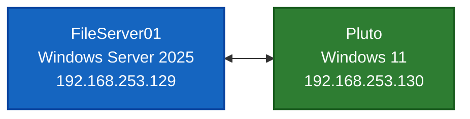

| Component | Hostname | IP Address | OS | Role |
|-----------|----------|------------|----|------|
| Server | `FileServer01` | 192.168.253.129 | Windows Server 2025 | Domain Controller, DNS, File Server |
| Client | `Pluto` | 192.168.253.130 | Windows 11 Pro | Domain-joined workstation |

- **Domain:** `homelab.local`
- **Hypervisor:** VMware Workstation

## What This Lab Demonstrates

These are the helpdesk-level skills I practiced while building this:

- Setting up a Windows domain and joining a client computer to it
- Creating, organizing, and managing user accounts in Active Directory
- Working with security groups and Organizational Units (OUs)
- Configuring basic Group Policy settings (login banner, password requirements, mapped drives)
- Setting up NTFS permissions so each department can only access their own files
- Troubleshooting a real-world ticket where a user's mapped drive went missing
- Using the tools a Tier 1 tech uses every day: ADUC, GPMC, Command Prompt (`gpresult`, `gpupdate`, `net use`, `whoami`)

## Setting Up The Domain

The first step was installing Windows Server 2025 and promoting it to a domain controller, which created the `homelab.local` domain. The same server also handles DNS (so client computers can find the domain) and hosts the file shares. In a real environment these would usually be separate servers, but combining them keeps the lab simple.

Once the domain was up, I joined the Windows 11 client (`Pluto`) to `homelab.local`. After that, anyone logging into Pluto with a domain account is authenticating against the server rather than the local machine. I verified everything was healthy by running `dcdiag` on the server and signing in as a domain user from the client.

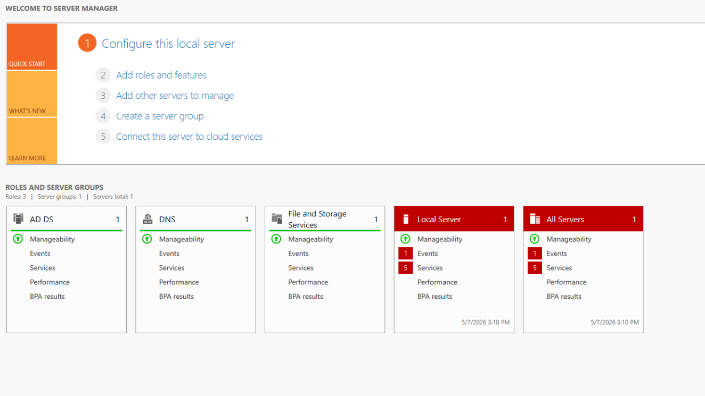
*Server Manager showing the three roles installed: Active Directory, DNS, and File Server.*

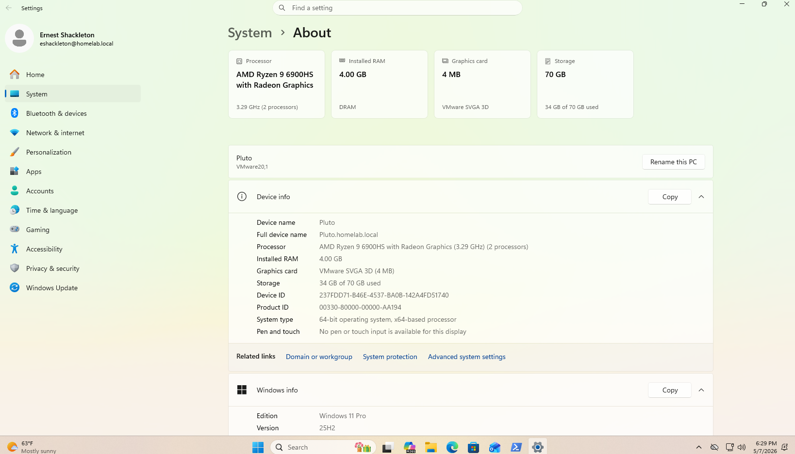
*The Windows 11 client successfully joined to the `homelab.local` domain.*

## Organizing The Directory

Active Directory uses Organizational Units (OUs) as folders for organizing users, computers, and groups. I set up a structure with a top-level USA OU containing sub-folders for different types of objects:

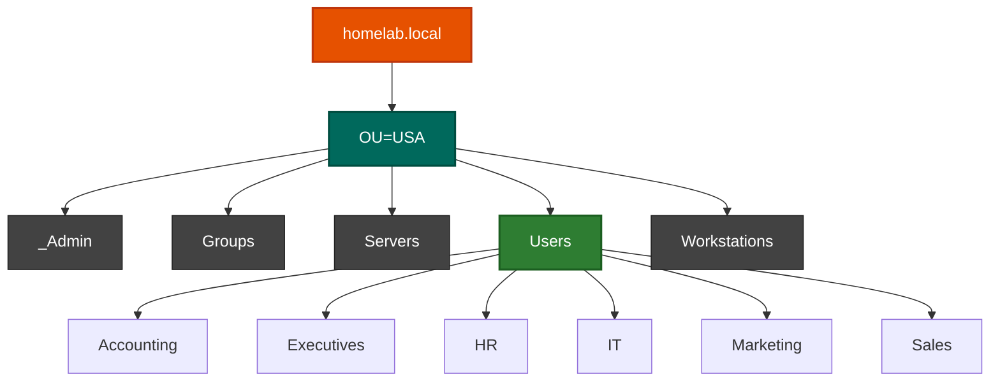

This separation matters because it lets Group Policy and permissions be applied to a specific set of objects without affecting others — for example, a policy targeting workstations doesn't accidentally hit a server.

## Creating Users & Groups

I created six security groups (one per department: Accounting, HR, IT, Marketing, Sales, Executives) and then around 50 user accounts, themed after famous explorers (Ernest Shackleton, Buzz Aldrin, etc., because it's more fun than test1/test2/test3).

Rather than clicking through ADUC 50 times, I used a PowerShell script to create all the users at once. The script goes down a list, creates each user, places them in the right department OU, sets a temporary password, and adds them to their department's security group. This is the kind of thing a helpdesk tech might run when onboarding a batch of new hires.

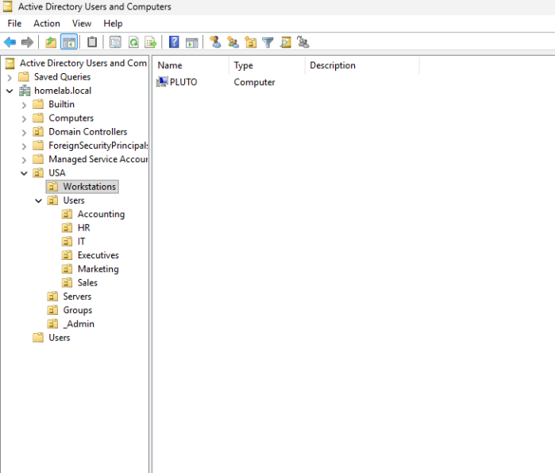
*The directory organized into OUs by purpose, with department folders under Users.*

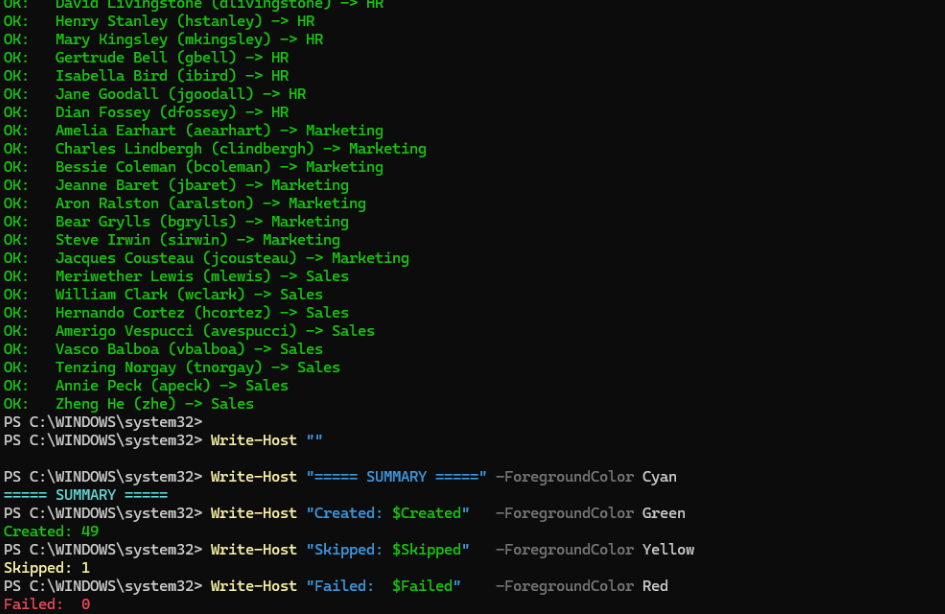
*Output from the bulk user creation script — 49 created, 1 skipped because that user already existed.*

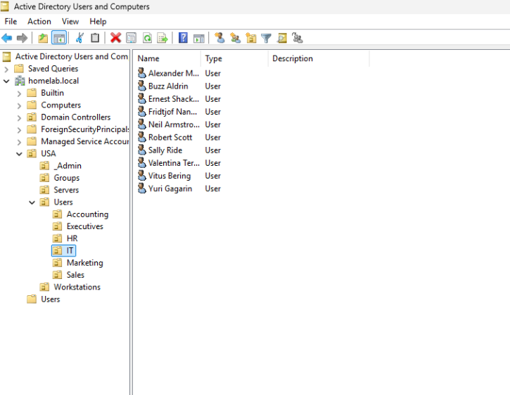
*The IT department OU after the script ran, populated with user accounts.*

## Group Policy

Group Policy is how Windows centrally applies settings across all the computers and users in a domain. Once you set up a Group Policy Object (GPO), it pushes settings out to whoever it targets. I configured several common ones a Tier 1 tech is likely to see in the field:

- **Login banner** — a warning message that pops up before users can sign in (common in workplaces for legal/security reasons)
- **Password requirements** — minimum password length and complexity rules
- **Mapped drives** — when a user logs in, they automatically get their department's shared folder mapped as the H: drive, plus a Public folder mapped as P:
- **Workstation security baseline** — screen locks after 10 minutes of inactivity, USB drives are read-only

To verify the policies were actually applying, I used `gpresult /h` on the client to generate a report showing exactly which GPOs got applied and where each setting came from.

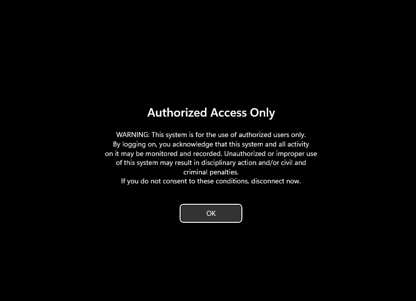
*The login banner appearing on the client before sign-in — applied via Group Policy domain-wide.*

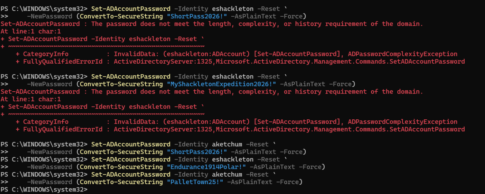
*Password requirements being enforced — a short password gets rejected for a privileged account but accepted for a regular user account.*

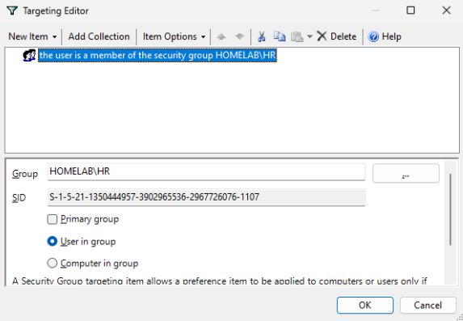
*Configuration for the HR drive mapping — set to apply only to users in the HR security group.*

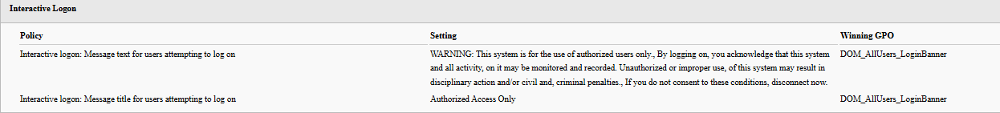
*The gpresult report showing which GPO is responsible for the login banner setting — useful for tracing where any setting came from.*

## File Share Permissions

I set up a shared folder (`C:\CompanyData`) on the server with subfolders for each department, plus a Public folder. The challenge is making sure each department can only access their own folder, while Public is open to everyone.

I did this through NTFS permissions and security groups: each department's security group gets "Modify" permission on its own folder. When users log in, they automatically have access to their department's stuff through their group membership.

When I first looked at the existing permissions on these folders, I found some real problems — HR had access to every folder (because of inherited permissions from the top folder), and three departments had no permissions on their own folders at all. So I cleaned things up by removing all the existing permissions and rebuilding them properly. 

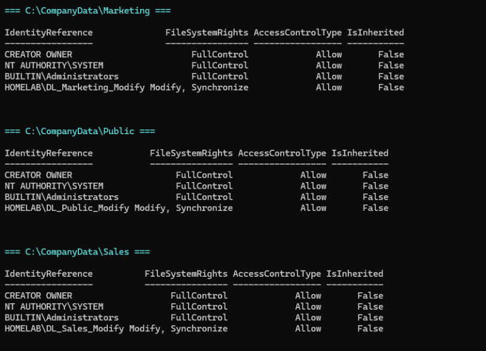
*After cleanup, every department folder has the same clean permission pattern — only the right department group can modify their own files.*

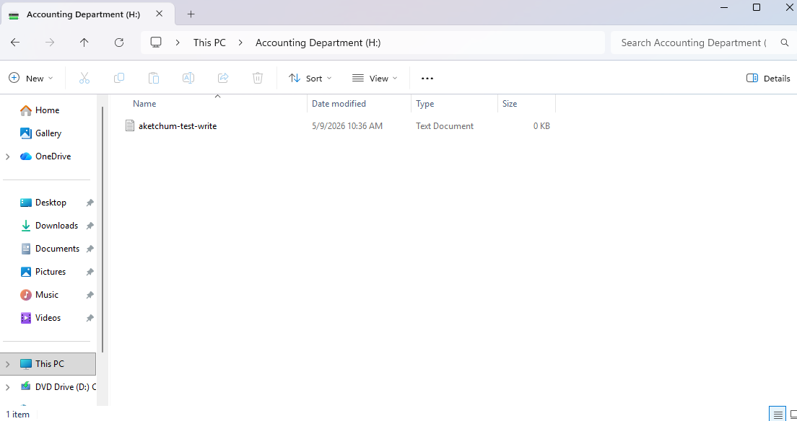
*User from Accounting successfully writing a file to his own department's H: drive.*

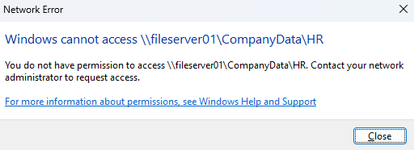
*Same user blocked when trying to access a different department's folder — the permissions are working.*

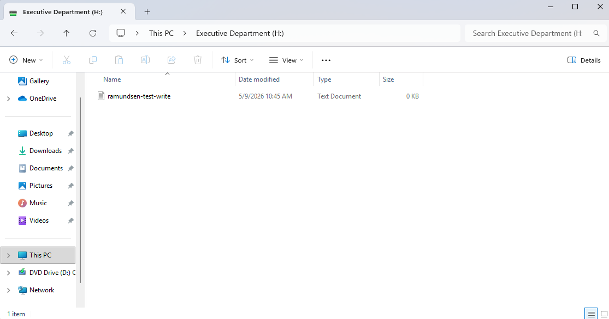
*User from Executives writing to his department folder after the permissions were rebuilt.*

## Troubleshooting Case Study

The most helpdesk-relevant part of this lab was a simulated ticket I worked through start to finish: a user reported their mapped H: drive was missing after they logged in. I walked through it like this — confirmed the symptom, checked the user's group memberships, ran `gpresult` to see what policies had applied, traced the issue back to the actual cause, and documented the whole thing.

Short version: the user had been accidentally removed from their department's security group, which is why the drive map didn't apply. Added them back, had them sign in fresh, and the drive came back.

For the full step-by-step writeup, see [Case Study: H: Drive Missing After Login](Docs/case-study-h-drive-missing.md).

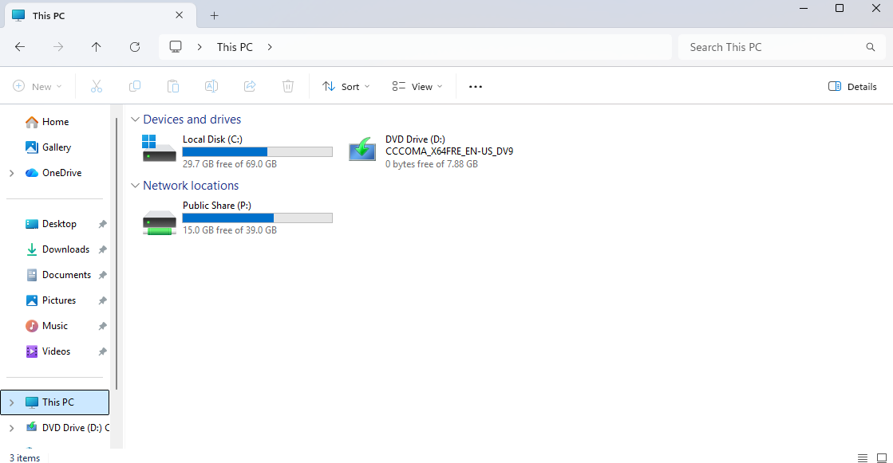
*The reported problem: only the Public (P:) drive shows up. The user's department H: drive is missing.*

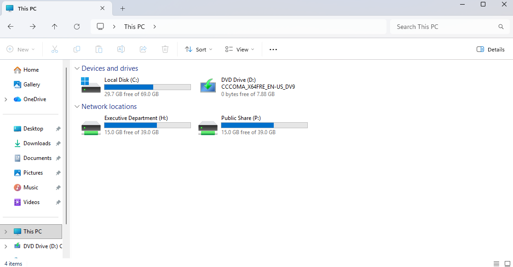
*After re-adding the user to the right group and logging back in, both drives appear correctly.*

## Tools used

- **Active Directory Users and Computers (ADUC)** — main tool for managing users, groups, and OUs
- **Group Policy Management Console (GPMC)** — for creating and editing GPOs
- **PowerShell** — for bulk user creation and some other automation
- **Command Prompt utilities** — `net use`, `whoami`, `gpresult`, `gpupdate`, `nslookup`, `dcdiag`
- **VMware Workstation** — for running the virtual machines

## Project Structure

```
active-directory-homelab/
├── README.md                 # This file
├── Docs/
│   ├── case-study-h-drive-missing.md
│   └── diagrams.md
├── Screenshots/              # Phase-by-phase screenshots
│   ├── Phase1/
│   ├── Phase2/
│   ├── Phase3/
│   ├── Phase4/
│   └── Phase5/
└── Scripts/                  # PowerShell scripts I used
    ├── phase2_1-create-ous.ps1
    ├── phase2_2-create-groups.ps1
    ├── phase2_3-create-users.ps1
    ├── phase2_4-backfill-existing-users.ps1
    ├── phase3_3-create-pso.ps1
    ├── phase4_2-teardown.ps1
    ├── phase4_3-build-dl-groups.ps1
    └── phase4_4-apply-dl-to-ntfs.ps1
```

## A note on AI assistance

This lab was built with significant AI assistance for PowerShell scripting and architectural guidance. I made the decisions about how to set things up, ran every step on the live system, and verified the results. The PowerShell scripts in `/Scripts` are repeatable and idempotent patterns — I can read them, explain them, and modify them, but I would not claim PowerShell expertise at this stage of my career.

The main thing I wanted to get out of this project was hands-on practice with the tools and tasks a Tier 1 helpdesk tech actually does day-to-day: ADUC, Group Policy, basic permissions, and Windows troubleshooting. The point isn't to claim mastery — it's to show I've done the work, can explain what I did, and can use these tools when a ticket lands on my desk.

---

   *John Boehler — CompTIA A+ certified, transitioning into IT.*  
   *[LinkedIn](https://www.linkedin.com/in/john-boehler-/) · [Email](mailto:johnsboehler@outlook.com)*